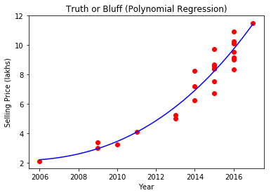
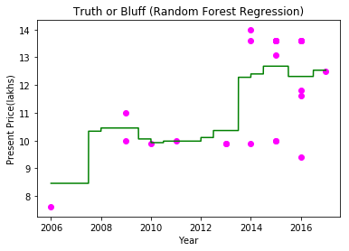

# Regression Analysis of Cars Data

## Importing the libraries


```python
import numpy as np
import matplotlib.pyplot as plt
import pandas as pd
```

## Importing the dataset


```python
dataset = pd.read_csv('car data.csv')
dataset
```


<div>
<style scoped>
    .dataframe tbody tr th:only-of-type {
        vertical-align: middle;
    }

    .dataframe tbody tr th {
        vertical-align: top;
    }

    .dataframe thead th {
        text-align: right;
    }
</style>
<table border="1" class="dataframe">
  <thead>
    <tr style="text-align: right;">
      <th></th>
      <th>Car_Name</th>
      <th>Year</th>
      <th>Selling_Price</th>
      <th>Present_Price</th>
      <th>Kms_Driven</th>
      <th>Fuel_Type</th>
      <th>Seller_Type</th>
      <th>Transmission</th>
      <th>Owner</th>
    </tr>
  </thead>
  <tbody>
    <tr>
      <th>0</th>
      <td>ritz</td>
      <td>2014</td>
      <td>3.35</td>
      <td>5.59</td>
      <td>27000</td>
      <td>Petrol</td>
      <td>Dealer</td>
      <td>Manual</td>
      <td>0</td>
    </tr>
    <tr>
      <th>1</th>
      <td>sx4</td>
      <td>2013</td>
      <td>4.75</td>
      <td>9.54</td>
      <td>43000</td>
      <td>Diesel</td>
      <td>Dealer</td>
      <td>Manual</td>
      <td>0</td>
    </tr>
    <tr>
      <th>2</th>
      <td>ciaz</td>
      <td>2017</td>
      <td>7.25</td>
      <td>9.85</td>
      <td>6900</td>
      <td>Petrol</td>
      <td>Dealer</td>
      <td>Manual</td>
      <td>0</td>
    </tr>
    <tr>
      <th>3</th>
      <td>wagon r</td>
      <td>2011</td>
      <td>2.85</td>
      <td>4.15</td>
      <td>5200</td>
      <td>Petrol</td>
      <td>Dealer</td>
      <td>Manual</td>
      <td>0</td>
    </tr>
    <tr>
      <th>4</th>
      <td>swift</td>
      <td>2014</td>
      <td>4.60</td>
      <td>6.87</td>
      <td>42450</td>
      <td>Diesel</td>
      <td>Dealer</td>
      <td>Manual</td>
      <td>0</td>
    </tr>
    <tr>
      <th>5</th>
      <td>vitara brezza</td>
      <td>2018</td>
      <td>9.25</td>
      <td>9.83</td>
      <td>2071</td>
      <td>Diesel</td>
      <td>Dealer</td>
      <td>Manual</td>
      <td>0</td>
    </tr>
    <tr>
      <th>6</th>
      <td>ciaz</td>
      <td>2015</td>
      <td>6.75</td>
      <td>8.12</td>
      <td>18796</td>
      <td>Petrol</td>
      <td>Dealer</td>
      <td>Manual</td>
      <td>0</td>
    </tr>
    <tr>
      <th>7</th>
      <td>s cross</td>
      <td>2015</td>
      <td>6.50</td>
      <td>8.61</td>
      <td>33429</td>
      <td>Diesel</td>
      <td>Dealer</td>
      <td>Manual</td>
      <td>0</td>
    </tr>
    <tr>
      <th>8</th>
      <td>ciaz</td>
      <td>2016</td>
      <td>8.75</td>
      <td>8.89</td>
      <td>20273</td>
      <td>Diesel</td>
      <td>Dealer</td>
      <td>Manual</td>
      <td>0</td>
    </tr>
    <tr>
      <th>9</th>
      <td>ciaz</td>
      <td>2015</td>
      <td>7.45</td>
      <td>8.92</td>
      <td>42367</td>
      <td>Diesel</td>
      <td>Dealer</td>
      <td>Manual</td>
      <td>0</td>
    </tr>
    <tr>
      <th>10</th>
      <td>alto 800</td>
      <td>2017</td>
      <td>2.85</td>
      <td>3.60</td>
      <td>2135</td>
      <td>Petrol</td>
      <td>Dealer</td>
      <td>Manual</td>
      <td>0</td>
    </tr>
    <tr>
      <th>11</th>
      <td>ciaz</td>
      <td>2015</td>
      <td>6.85</td>
      <td>10.38</td>
      <td>51000</td>
      <td>Diesel</td>
      <td>Dealer</td>
      <td>Manual</td>
      <td>0</td>
    </tr>
    <tr>
      <th>12</th>
      <td>ciaz</td>
      <td>2015</td>
      <td>7.50</td>
      <td>9.94</td>
      <td>15000</td>
      <td>Petrol</td>
      <td>Dealer</td>
      <td>Automatic</td>
      <td>0</td>
    </tr>
    <tr>
      <th>13</th>
      <td>ertiga</td>
      <td>2015</td>
      <td>6.10</td>
      <td>7.71</td>
      <td>26000</td>
      <td>Petrol</td>
      <td>Dealer</td>
      <td>Manual</td>
      <td>0</td>
    </tr>
    <tr>
      <th>14</th>
      <td>dzire</td>
      <td>2009</td>
      <td>2.25</td>
      <td>7.21</td>
      <td>77427</td>
      <td>Petrol</td>
      <td>Dealer</td>
      <td>Manual</td>
      <td>0</td>
    </tr>
    <tr>
      <th>15</th>
      <td>ertiga</td>
      <td>2016</td>
      <td>7.75</td>
      <td>10.79</td>
      <td>43000</td>
      <td>Diesel</td>
      <td>Dealer</td>
      <td>Manual</td>
      <td>0</td>
    </tr>
    <tr>
      <th>16</th>
      <td>ertiga</td>
      <td>2015</td>
      <td>7.25</td>
      <td>10.79</td>
      <td>41678</td>
      <td>Diesel</td>
      <td>Dealer</td>
      <td>Manual</td>
      <td>0</td>
    </tr>
    <tr>
      <th>17</th>
      <td>ertiga</td>
      <td>2016</td>
      <td>7.75</td>
      <td>10.79</td>
      <td>43000</td>
      <td>Diesel</td>
      <td>Dealer</td>
      <td>Manual</td>
      <td>0</td>
    </tr>
    <tr>
      <th>18</th>
      <td>wagon r</td>
      <td>2015</td>
      <td>3.25</td>
      <td>5.09</td>
      <td>35500</td>
      <td>CNG</td>
      <td>Dealer</td>
      <td>Manual</td>
      <td>0</td>
    </tr>
    <tr>
      <th>19</th>
      <td>sx4</td>
      <td>2010</td>
      <td>2.65</td>
      <td>7.98</td>
      <td>41442</td>
      <td>Petrol</td>
      <td>Dealer</td>
      <td>Manual</td>
      <td>0</td>
    </tr>
    <tr>
      <th>20</th>
      <td>alto k10</td>
      <td>2016</td>
      <td>2.85</td>
      <td>3.95</td>
      <td>25000</td>
      <td>Petrol</td>
      <td>Dealer</td>
      <td>Manual</td>
      <td>0</td>
    </tr>
    <tr>
      <th>21</th>
      <td>ignis</td>
      <td>2017</td>
      <td>4.90</td>
      <td>5.71</td>
      <td>2400</td>
      <td>Petrol</td>
      <td>Dealer</td>
      <td>Manual</td>
      <td>0</td>
    </tr>
    <tr>
      <th>22</th>
      <td>sx4</td>
      <td>2011</td>
      <td>4.40</td>
      <td>8.01</td>
      <td>50000</td>
      <td>Petrol</td>
      <td>Dealer</td>
      <td>Automatic</td>
      <td>0</td>
    </tr>
    <tr>
      <th>23</th>
      <td>alto k10</td>
      <td>2014</td>
      <td>2.50</td>
      <td>3.46</td>
      <td>45280</td>
      <td>Petrol</td>
      <td>Dealer</td>
      <td>Manual</td>
      <td>0</td>
    </tr>
    <tr>
      <th>24</th>
      <td>wagon r</td>
      <td>2013</td>
      <td>2.90</td>
      <td>4.41</td>
      <td>56879</td>
      <td>Petrol</td>
      <td>Dealer</td>
      <td>Manual</td>
      <td>0</td>
    </tr>
    <tr>
      <th>25</th>
      <td>swift</td>
      <td>2011</td>
      <td>3.00</td>
      <td>4.99</td>
      <td>20000</td>
      <td>Petrol</td>
      <td>Dealer</td>
      <td>Manual</td>
      <td>0</td>
    </tr>
    <tr>
      <th>26</th>
      <td>swift</td>
      <td>2013</td>
      <td>4.15</td>
      <td>5.87</td>
      <td>55138</td>
      <td>Petrol</td>
      <td>Dealer</td>
      <td>Manual</td>
      <td>0</td>
    </tr>
    <tr>
      <th>27</th>
      <td>swift</td>
      <td>2017</td>
      <td>6.00</td>
      <td>6.49</td>
      <td>16200</td>
      <td>Petrol</td>
      <td>Individual</td>
      <td>Manual</td>
      <td>0</td>
    </tr>
    <tr>
      <th>28</th>
      <td>alto k10</td>
      <td>2010</td>
      <td>1.95</td>
      <td>3.95</td>
      <td>44542</td>
      <td>Petrol</td>
      <td>Dealer</td>
      <td>Manual</td>
      <td>0</td>
    </tr>
    <tr>
      <th>29</th>
      <td>ciaz</td>
      <td>2015</td>
      <td>7.45</td>
      <td>10.38</td>
      <td>45000</td>
      <td>Diesel</td>
      <td>Dealer</td>
      <td>Manual</td>
      <td>0</td>
    </tr>
    <tr>
      <th>...</th>
      <td>...</td>
      <td>...</td>
      <td>...</td>
      <td>...</td>
      <td>...</td>
      <td>...</td>
      <td>...</td>
      <td>...</td>
      <td>...</td>
    </tr>
    <tr>
      <th>271</th>
      <td>city</td>
      <td>2009</td>
      <td>3.00</td>
      <td>10.00</td>
      <td>69562</td>
      <td>Petrol</td>
      <td>Dealer</td>
      <td>Manual</td>
      <td>0</td>
    </tr>
    <tr>
      <th>272</th>
      <td>city</td>
      <td>2015</td>
      <td>7.50</td>
      <td>10.00</td>
      <td>27600</td>
      <td>Petrol</td>
      <td>Dealer</td>
      <td>Manual</td>
      <td>0</td>
    </tr>
    <tr>
      <th>273</th>
      <td>jazz</td>
      <td>2010</td>
      <td>2.25</td>
      <td>7.50</td>
      <td>61203</td>
      <td>Petrol</td>
      <td>Dealer</td>
      <td>Manual</td>
      <td>0</td>
    </tr>
    <tr>
      <th>274</th>
      <td>brio</td>
      <td>2014</td>
      <td>5.30</td>
      <td>6.80</td>
      <td>16500</td>
      <td>Petrol</td>
      <td>Dealer</td>
      <td>Manual</td>
      <td>0</td>
    </tr>
    <tr>
      <th>275</th>
      <td>city</td>
      <td>2016</td>
      <td>10.90</td>
      <td>13.60</td>
      <td>30753</td>
      <td>Petrol</td>
      <td>Dealer</td>
      <td>Automatic</td>
      <td>0</td>
    </tr>
    <tr>
      <th>276</th>
      <td>city</td>
      <td>2015</td>
      <td>8.65</td>
      <td>13.60</td>
      <td>24800</td>
      <td>Petrol</td>
      <td>Dealer</td>
      <td>Manual</td>
      <td>0</td>
    </tr>
    <tr>
      <th>277</th>
      <td>city</td>
      <td>2015</td>
      <td>9.70</td>
      <td>13.60</td>
      <td>21780</td>
      <td>Petrol</td>
      <td>Dealer</td>
      <td>Manual</td>
      <td>0</td>
    </tr>
    <tr>
      <th>278</th>
      <td>jazz</td>
      <td>2016</td>
      <td>6.00</td>
      <td>8.40</td>
      <td>4000</td>
      <td>Petrol</td>
      <td>Dealer</td>
      <td>Manual</td>
      <td>0</td>
    </tr>
    <tr>
      <th>279</th>
      <td>city</td>
      <td>2014</td>
      <td>6.25</td>
      <td>13.60</td>
      <td>40126</td>
      <td>Petrol</td>
      <td>Dealer</td>
      <td>Manual</td>
      <td>0</td>
    </tr>
    <tr>
      <th>280</th>
      <td>brio</td>
      <td>2015</td>
      <td>5.25</td>
      <td>5.90</td>
      <td>14465</td>
      <td>Petrol</td>
      <td>Dealer</td>
      <td>Manual</td>
      <td>0</td>
    </tr>
    <tr>
      <th>281</th>
      <td>city</td>
      <td>2006</td>
      <td>2.10</td>
      <td>7.60</td>
      <td>50456</td>
      <td>Petrol</td>
      <td>Dealer</td>
      <td>Manual</td>
      <td>0</td>
    </tr>
    <tr>
      <th>282</th>
      <td>city</td>
      <td>2014</td>
      <td>8.25</td>
      <td>14.00</td>
      <td>63000</td>
      <td>Diesel</td>
      <td>Dealer</td>
      <td>Manual</td>
      <td>0</td>
    </tr>
    <tr>
      <th>283</th>
      <td>city</td>
      <td>2016</td>
      <td>8.99</td>
      <td>11.80</td>
      <td>9010</td>
      <td>Petrol</td>
      <td>Dealer</td>
      <td>Manual</td>
      <td>0</td>
    </tr>
    <tr>
      <th>284</th>
      <td>brio</td>
      <td>2013</td>
      <td>3.50</td>
      <td>5.90</td>
      <td>9800</td>
      <td>Petrol</td>
      <td>Dealer</td>
      <td>Manual</td>
      <td>0</td>
    </tr>
    <tr>
      <th>285</th>
      <td>jazz</td>
      <td>2016</td>
      <td>7.40</td>
      <td>8.50</td>
      <td>15059</td>
      <td>Petrol</td>
      <td>Dealer</td>
      <td>Automatic</td>
      <td>0</td>
    </tr>
    <tr>
      <th>286</th>
      <td>jazz</td>
      <td>2016</td>
      <td>5.65</td>
      <td>7.90</td>
      <td>28569</td>
      <td>Petrol</td>
      <td>Dealer</td>
      <td>Manual</td>
      <td>0</td>
    </tr>
    <tr>
      <th>287</th>
      <td>amaze</td>
      <td>2015</td>
      <td>5.75</td>
      <td>7.50</td>
      <td>44000</td>
      <td>Petrol</td>
      <td>Dealer</td>
      <td>Automatic</td>
      <td>0</td>
    </tr>
    <tr>
      <th>288</th>
      <td>city</td>
      <td>2015</td>
      <td>8.40</td>
      <td>13.60</td>
      <td>34000</td>
      <td>Petrol</td>
      <td>Dealer</td>
      <td>Manual</td>
      <td>0</td>
    </tr>
    <tr>
      <th>289</th>
      <td>city</td>
      <td>2016</td>
      <td>10.11</td>
      <td>13.60</td>
      <td>10980</td>
      <td>Petrol</td>
      <td>Dealer</td>
      <td>Manual</td>
      <td>0</td>
    </tr>
    <tr>
      <th>290</th>
      <td>amaze</td>
      <td>2014</td>
      <td>4.50</td>
      <td>6.40</td>
      <td>19000</td>
      <td>Petrol</td>
      <td>Dealer</td>
      <td>Manual</td>
      <td>0</td>
    </tr>
    <tr>
      <th>291</th>
      <td>brio</td>
      <td>2015</td>
      <td>5.40</td>
      <td>6.10</td>
      <td>31427</td>
      <td>Petrol</td>
      <td>Dealer</td>
      <td>Manual</td>
      <td>0</td>
    </tr>
    <tr>
      <th>292</th>
      <td>jazz</td>
      <td>2016</td>
      <td>6.40</td>
      <td>8.40</td>
      <td>12000</td>
      <td>Petrol</td>
      <td>Dealer</td>
      <td>Manual</td>
      <td>0</td>
    </tr>
    <tr>
      <th>293</th>
      <td>city</td>
      <td>2010</td>
      <td>3.25</td>
      <td>9.90</td>
      <td>38000</td>
      <td>Petrol</td>
      <td>Dealer</td>
      <td>Manual</td>
      <td>0</td>
    </tr>
    <tr>
      <th>294</th>
      <td>amaze</td>
      <td>2014</td>
      <td>3.75</td>
      <td>6.80</td>
      <td>33019</td>
      <td>Petrol</td>
      <td>Dealer</td>
      <td>Manual</td>
      <td>0</td>
    </tr>
    <tr>
      <th>295</th>
      <td>city</td>
      <td>2015</td>
      <td>8.55</td>
      <td>13.09</td>
      <td>60076</td>
      <td>Diesel</td>
      <td>Dealer</td>
      <td>Manual</td>
      <td>0</td>
    </tr>
    <tr>
      <th>296</th>
      <td>city</td>
      <td>2016</td>
      <td>9.50</td>
      <td>11.60</td>
      <td>33988</td>
      <td>Diesel</td>
      <td>Dealer</td>
      <td>Manual</td>
      <td>0</td>
    </tr>
    <tr>
      <th>297</th>
      <td>brio</td>
      <td>2015</td>
      <td>4.00</td>
      <td>5.90</td>
      <td>60000</td>
      <td>Petrol</td>
      <td>Dealer</td>
      <td>Manual</td>
      <td>0</td>
    </tr>
    <tr>
      <th>298</th>
      <td>city</td>
      <td>2009</td>
      <td>3.35</td>
      <td>11.00</td>
      <td>87934</td>
      <td>Petrol</td>
      <td>Dealer</td>
      <td>Manual</td>
      <td>0</td>
    </tr>
    <tr>
      <th>299</th>
      <td>city</td>
      <td>2017</td>
      <td>11.50</td>
      <td>12.50</td>
      <td>9000</td>
      <td>Diesel</td>
      <td>Dealer</td>
      <td>Manual</td>
      <td>0</td>
    </tr>
    <tr>
      <th>300</th>
      <td>brio</td>
      <td>2016</td>
      <td>5.30</td>
      <td>5.90</td>
      <td>5464</td>
      <td>Petrol</td>
      <td>Dealer</td>
      <td>Manual</td>
      <td>0</td>
    </tr>
  </tbody>
</table>
<p>301 rows × 9 columns</p>
</div>


```python
Name = dataset['Car_Name']
```

### Converting the Name to DataFrame


```python
Name = pd.DataFrame(Name)
Name
```


<div>
<style scoped>
    .dataframe tbody tr th:only-of-type {
        vertical-align: middle;
    }

    .dataframe tbody tr th {
        vertical-align: top;
    }

    .dataframe thead th {
        text-align: right;
    }
</style>
<table border="1" class="dataframe">
  <thead>
    <tr style="text-align: right;">
      <th></th>
      <th>Car_Name</th>
    </tr>
  </thead>
  <tbody>
    <tr>
      <th>0</th>
      <td>ritz</td>
    </tr>
    <tr>
      <th>1</th>
      <td>sx4</td>
    </tr>
    <tr>
      <th>2</th>
      <td>ciaz</td>
    </tr>
    <tr>
      <th>3</th>
      <td>wagon r</td>
    </tr>
    <tr>
      <th>4</th>
      <td>swift</td>
    </tr>
    <tr>
      <th>5</th>
      <td>vitara brezza</td>
    </tr>
    <tr>
      <th>6</th>
      <td>ciaz</td>
    </tr>
    <tr>
      <th>7</th>
      <td>s cross</td>
    </tr>
    <tr>
      <th>8</th>
      <td>ciaz</td>
    </tr>
    <tr>
      <th>9</th>
      <td>ciaz</td>
    </tr>
    <tr>
      <th>10</th>
      <td>alto 800</td>
    </tr>
    <tr>
      <th>11</th>
      <td>ciaz</td>
    </tr>
    <tr>
      <th>12</th>
      <td>ciaz</td>
    </tr>
    <tr>
      <th>13</th>
      <td>ertiga</td>
    </tr>
    <tr>
      <th>14</th>
      <td>dzire</td>
    </tr>
    <tr>
      <th>15</th>
      <td>ertiga</td>
    </tr>
    <tr>
      <th>16</th>
      <td>ertiga</td>
    </tr>
    <tr>
      <th>17</th>
      <td>ertiga</td>
    </tr>
    <tr>
      <th>18</th>
      <td>wagon r</td>
    </tr>
    <tr>
      <th>19</th>
      <td>sx4</td>
    </tr>
    <tr>
      <th>20</th>
      <td>alto k10</td>
    </tr>
    <tr>
      <th>21</th>
      <td>ignis</td>
    </tr>
    <tr>
      <th>22</th>
      <td>sx4</td>
    </tr>
    <tr>
      <th>23</th>
      <td>alto k10</td>
    </tr>
    <tr>
      <th>24</th>
      <td>wagon r</td>
    </tr>
    <tr>
      <th>25</th>
      <td>swift</td>
    </tr>
    <tr>
      <th>26</th>
      <td>swift</td>
    </tr>
    <tr>
      <th>27</th>
      <td>swift</td>
    </tr>
    <tr>
      <th>28</th>
      <td>alto k10</td>
    </tr>
    <tr>
      <th>29</th>
      <td>ciaz</td>
    </tr>
    <tr>
      <th>...</th>
      <td>...</td>
    </tr>
    <tr>
      <th>271</th>
      <td>city</td>
    </tr>
    <tr>
      <th>272</th>
      <td>city</td>
    </tr>
    <tr>
      <th>273</th>
      <td>jazz</td>
    </tr>
    <tr>
      <th>274</th>
      <td>brio</td>
    </tr>
    <tr>
      <th>275</th>
      <td>city</td>
    </tr>
    <tr>
      <th>276</th>
      <td>city</td>
    </tr>
    <tr>
      <th>277</th>
      <td>city</td>
    </tr>
    <tr>
      <th>278</th>
      <td>jazz</td>
    </tr>
    <tr>
      <th>279</th>
      <td>city</td>
    </tr>
    <tr>
      <th>280</th>
      <td>brio</td>
    </tr>
    <tr>
      <th>281</th>
      <td>city</td>
    </tr>
    <tr>
      <th>282</th>
      <td>city</td>
    </tr>
    <tr>
      <th>283</th>
      <td>city</td>
    </tr>
    <tr>
      <th>284</th>
      <td>brio</td>
    </tr>
    <tr>
      <th>285</th>
      <td>jazz</td>
    </tr>
    <tr>
      <th>286</th>
      <td>jazz</td>
    </tr>
    <tr>
      <th>287</th>
      <td>amaze</td>
    </tr>
    <tr>
      <th>288</th>
      <td>city</td>
    </tr>
    <tr>
      <th>289</th>
      <td>city</td>
    </tr>
    <tr>
      <th>290</th>
      <td>amaze</td>
    </tr>
    <tr>
      <th>291</th>
      <td>brio</td>
    </tr>
    <tr>
      <th>292</th>
      <td>jazz</td>
    </tr>
    <tr>
      <th>293</th>
      <td>city</td>
    </tr>
    <tr>
      <th>294</th>
      <td>amaze</td>
    </tr>
    <tr>
      <th>295</th>
      <td>city</td>
    </tr>
    <tr>
      <th>296</th>
      <td>city</td>
    </tr>
    <tr>
      <th>297</th>
      <td>brio</td>
    </tr>
    <tr>
      <th>298</th>
      <td>city</td>
    </tr>
    <tr>
      <th>299</th>
      <td>city</td>
    </tr>
    <tr>
      <th>300</th>
      <td>brio</td>
    </tr>
  </tbody>
</table>
<p>301 rows × 1 columns</p>
</div>


## Calculating the Name of the most frquent car 


```python
Name.Car_Name.value_counts()
```


    city                         26
    corolla altis                16
    verna                        14
    fortuner                     11
    brio                         10
    ciaz                          9
    innova                        9
    i20                           9
    grand i10                     8
    Royal Enfield Classic 350     7
    amaze                         7
    jazz                          7
    sx4                           6
    eon                           6
    ertiga                        6
    i10                           5
    alto k10                      5
    swift                         5
    dzire                         4
    ritz                          4
    etios liva                    4
    wagon r                       4
    Royal Enfield Thunder 350     4
    Bajaj Pulsar 150              4
    Bajaj Pulsar NS 200           3
    Honda CB Hornet 160R          3
    Royal Enfield Thunder 500     3
    Yamaha FZ S V 2.0             3
    TVS Apache RTR 160            3
    xcent                         3
                                 ..
    Bajaj Dominar 400             1
    KTM RC390                     1
    Hero Super Splendor           1
    Bajaj Avenger Street 220      1
    Bajaj  ct 100                 1
    Yamaha Fazer                  1
    land cruiser                  1
    KTM 390 Duke                  1
    UM Renegade Mojave            1
    Yamaha FZ 16                  1
    Activa 4g                     1
    Hero Splender Plus            1
    Hero Passion X pro            1
    Yamaha FZ S                   1
    TVS Sport                     1
    Hero Hunk                     1
    vitara brezza                 1
    TVS Jupyter                   1
    Hero Glamour                  1
    Bajaj Pulsar RS200            1
    camry                         1
    Hero Honda Passion Pro        1
    Bajaj Avenger 150 street      1
    alto 800                      1
    TVS Wego                      1
    ignis                         1
    Honda CB Unicorn              1
    corolla                       1
    Bajaj Discover 100            1
    Bajaj Pulsar 135 LS           1
    Name: Car_Name, Length: 98, dtype: int64


# For Selling Price

#### As we can see that the Honda City is the most Frequent Car therefore we filter the dataset with only Honda City data.


```python
df = dataset.loc[dataset['Car_Name'] == "city"].iloc[:, 1:5]
X = df.iloc[:, 0:1].values
y1 = df.iloc[:, 1:2].values
df
```


<div>
<style scoped>
    .dataframe tbody tr th:only-of-type {
        vertical-align: middle;
    }

    .dataframe tbody tr th {
        vertical-align: top;
    }

    .dataframe thead th {
        text-align: right;
    }
</style>
<table border="1" class="dataframe">
  <thead>
    <tr style="text-align: right;">
      <th></th>
      <th>Year</th>
      <th>Selling_Price</th>
      <th>Present_Price</th>
      <th>Kms_Driven</th>
    </tr>
  </thead>
  <tbody>
    <tr>
      <th>251</th>
      <td>2013</td>
      <td>5.00</td>
      <td>9.90</td>
      <td>56701</td>
    </tr>
    <tr>
      <th>253</th>
      <td>2014</td>
      <td>7.20</td>
      <td>9.90</td>
      <td>48000</td>
    </tr>
    <tr>
      <th>254</th>
      <td>2013</td>
      <td>5.25</td>
      <td>9.90</td>
      <td>54242</td>
    </tr>
    <tr>
      <th>256</th>
      <td>2016</td>
      <td>10.25</td>
      <td>13.60</td>
      <td>49562</td>
    </tr>
    <tr>
      <th>257</th>
      <td>2015</td>
      <td>8.50</td>
      <td>13.60</td>
      <td>40324</td>
    </tr>
    <tr>
      <th>258</th>
      <td>2015</td>
      <td>8.40</td>
      <td>13.60</td>
      <td>25000</td>
    </tr>
    <tr>
      <th>260</th>
      <td>2016</td>
      <td>9.15</td>
      <td>13.60</td>
      <td>29223</td>
    </tr>
    <tr>
      <th>267</th>
      <td>2016</td>
      <td>8.35</td>
      <td>9.40</td>
      <td>19434</td>
    </tr>
    <tr>
      <th>269</th>
      <td>2015</td>
      <td>6.70</td>
      <td>10.00</td>
      <td>18828</td>
    </tr>
    <tr>
      <th>270</th>
      <td>2011</td>
      <td>4.10</td>
      <td>10.00</td>
      <td>69341</td>
    </tr>
    <tr>
      <th>271</th>
      <td>2009</td>
      <td>3.00</td>
      <td>10.00</td>
      <td>69562</td>
    </tr>
    <tr>
      <th>272</th>
      <td>2015</td>
      <td>7.50</td>
      <td>10.00</td>
      <td>27600</td>
    </tr>
    <tr>
      <th>275</th>
      <td>2016</td>
      <td>10.90</td>
      <td>13.60</td>
      <td>30753</td>
    </tr>
    <tr>
      <th>276</th>
      <td>2015</td>
      <td>8.65</td>
      <td>13.60</td>
      <td>24800</td>
    </tr>
    <tr>
      <th>277</th>
      <td>2015</td>
      <td>9.70</td>
      <td>13.60</td>
      <td>21780</td>
    </tr>
    <tr>
      <th>279</th>
      <td>2014</td>
      <td>6.25</td>
      <td>13.60</td>
      <td>40126</td>
    </tr>
    <tr>
      <th>281</th>
      <td>2006</td>
      <td>2.10</td>
      <td>7.60</td>
      <td>50456</td>
    </tr>
    <tr>
      <th>282</th>
      <td>2014</td>
      <td>8.25</td>
      <td>14.00</td>
      <td>63000</td>
    </tr>
    <tr>
      <th>283</th>
      <td>2016</td>
      <td>8.99</td>
      <td>11.80</td>
      <td>9010</td>
    </tr>
    <tr>
      <th>288</th>
      <td>2015</td>
      <td>8.40</td>
      <td>13.60</td>
      <td>34000</td>
    </tr>
    <tr>
      <th>289</th>
      <td>2016</td>
      <td>10.11</td>
      <td>13.60</td>
      <td>10980</td>
    </tr>
    <tr>
      <th>293</th>
      <td>2010</td>
      <td>3.25</td>
      <td>9.90</td>
      <td>38000</td>
    </tr>
    <tr>
      <th>295</th>
      <td>2015</td>
      <td>8.55</td>
      <td>13.09</td>
      <td>60076</td>
    </tr>
    <tr>
      <th>296</th>
      <td>2016</td>
      <td>9.50</td>
      <td>11.60</td>
      <td>33988</td>
    </tr>
    <tr>
      <th>298</th>
      <td>2009</td>
      <td>3.35</td>
      <td>11.00</td>
      <td>87934</td>
    </tr>
    <tr>
      <th>299</th>
      <td>2017</td>
      <td>11.50</td>
      <td>12.50</td>
      <td>9000</td>
    </tr>
  </tbody>
</table>
</div>


X Variable contains the Year Attribute


```python
X
```


    array([[2013],
           [2014],
           [2013],
           [2016],
           [2015],
           [2015],
           [2016],
           [2016],
           [2015],
           [2011],
           [2009],
           [2015],
           [2016],
           [2015],
           [2015],
           [2014],
           [2006],
           [2014],
           [2016],
           [2015],
           [2016],
           [2010],
           [2015],
           [2016],
           [2009],
           [2017]], dtype=int64)


y1 Variable contains Selling Price Attribute


```python
y1
```


    array([[ 5.  ],
           [ 7.2 ],
           [ 5.25],
           [10.25],
           [ 8.5 ],
           [ 8.4 ],
           [ 9.15],
           [ 8.35],
           [ 6.7 ],
           [ 4.1 ],
           [ 3.  ],
           [ 7.5 ],
           [10.9 ],
           [ 8.65],
           [ 9.7 ],
           [ 6.25],
           [ 2.1 ],
           [ 8.25],
           [ 8.99],
           [ 8.4 ],
           [10.11],
           [ 3.25],
           [ 8.55],
           [ 9.5 ],
           [ 3.35],
           [11.5 ]])


## Fitting Linear Regression to the dataset


```python
from sklearn.linear_model import LinearRegression
lin_reg = LinearRegression()
lin_reg.fit(X, y1)
```


    LinearRegression(copy_X=True, fit_intercept=True, n_jobs=1, normalize=False)


## Fitting Polynomial Regression to the dataset


```python
from sklearn.preprocessing import PolynomialFeatures
poly_reg = PolynomialFeatures(degree = 5)
X_poly = poly_reg.fit_transform(X)
poly_reg.fit(X_poly, y1)
lin_reg_2 = LinearRegression()
lin_reg_2.fit(X_poly, y1)
```


    LinearRegression(copy_X=True, fit_intercept=True, n_jobs=1, normalize=False)


## Visualising the Polynomial Regression results (for higher resolution and smoother curve)


```python
X_grid = np.arange(min(X), max(X), 0.01)
X_grid = X_grid.reshape((len(X_grid), 1))
plt.scatter(X, y1, color = 'red')
plt.plot(X_grid, lin_reg_2.predict(poly_reg.fit_transform(X_grid)), color = 'blue')
plt.title('Truth or Bluff (Polynomial Regression)')
plt.xlabel('Year')
plt.ylabel('Selling Price (lakhs)')
plt.show()
```





#### Now I'll create a predicted variable which predicts the possible Prices of the City Car with Respect to Corresponding Year


```python
y1_pred = lin_reg_2.predict(poly_reg.fit_transform(X))
y1_pred
```


    array([[ 5.78542746],
           [ 6.90189036],
           [ 5.78542746],
           [ 9.70887467],
           [ 8.20562282],
           [ 8.20562282],
           [ 9.70887467],
           [ 9.70887467],
           [ 8.20562282],
           [ 4.0654889 ],
           [ 2.94851998],
           [ 8.20562282],
           [ 9.70887467],
           [ 8.20562282],
           [ 8.20562282],
           [ 6.90189036],
           [ 2.19221686],
           [ 6.90189036],
           [ 9.70887467],
           [ 8.20562282],
           [ 9.70887467],
           [ 3.43769148],
           [ 8.20562282],
           [ 9.70887467],
           [ 2.94851998],
           [11.42393141]])


This array above giving us the information of the predicted Selling prices that should have with the respective Corresponding Year


# For Present Price

#### We Will take the X Variable because of the same Corresponding Year

y2 Variable contains Present Price Attribute


```python
y2 = df.iloc[:, 2:3].values
y2
```


    array([[ 9.9 ],
           [ 9.9 ],
           [ 9.9 ],
           [13.6 ],
           [13.6 ],
           [13.6 ],
           [13.6 ],
           [ 9.4 ],
           [10.  ],
           [10.  ],
           [10.  ],
           [10.  ],
           [13.6 ],
           [13.6 ],
           [13.6 ],
           [13.6 ],
           [ 7.6 ],
           [14.  ],
           [11.8 ],
           [13.6 ],
           [13.6 ],
           [ 9.9 ],
           [13.09],
           [11.6 ],
           [11.  ],
           [12.5 ]])


## Fitting Random Forest Regression to the dataset


```python
from sklearn.ensemble import RandomForestRegressor
regressor = RandomForestRegressor(n_estimators = 20, random_state = 0)
regressor.fit(X, y2)
```

    c:\users\vdwal\appdata\local\programs\python\python36\lib\site-packages\ipykernel_launcher.py:3: DataConversionWarning: A column-vector y was passed when a 1d array was expected. Please change the shape of y to (n_samples,), for example using ravel().
      This is separate from the ipykernel package so we can avoid doing imports until
    


    RandomForestRegressor(bootstrap=True, criterion='mse', max_depth=None,
               max_features='auto', max_leaf_nodes=None,
               min_impurity_decrease=0.0, min_impurity_split=None,
               min_samples_leaf=1, min_samples_split=2,
               min_weight_fraction_leaf=0.0, n_estimators=20, n_jobs=1,
               oob_score=False, random_state=0, verbose=0, warm_start=False)


```python
y2_pred = regressor.predict(X)
y2_pred
```


    array([10.36166667, 12.27891667, 10.36166667, 12.30909848, 12.67845925,
           12.67845925, 12.30909848, 12.30909848, 12.67845925,  9.98      ,
           10.4525    , 12.67845925, 12.30909848, 12.67845925, 12.67845925,
           12.27891667,  8.46083333, 12.27891667, 12.30909848, 12.67845925,
           12.30909848, 10.05833333, 12.67845925, 12.30909848, 10.4525    ,
           12.53383333])


This array above giving us the information of the predicted Present prices that should have with the respective Corresponding Year

## Visualising the Random Forest Regression results (higher resolution)


```python
X_grid = np.arange(min(X), max(X), 0.001)
X_grid = X_grid.reshape((len(X_grid), 1))
plt.scatter(X, y2, color = 'magenta')
plt.plot(X_grid, regressor.predict(X_grid), color = 'green')
plt.title('Truth or Bluff (Random Forest Regression)')
plt.xlabel('Year')
plt.ylabel('Present Price(lakhs)')
plt.show()
```




